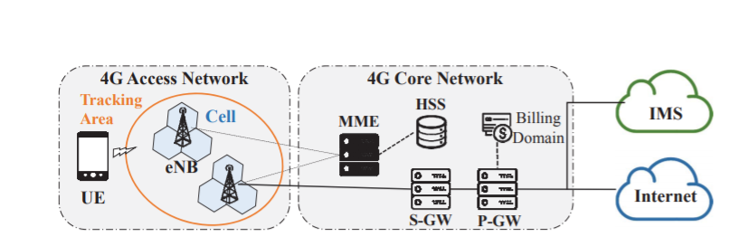
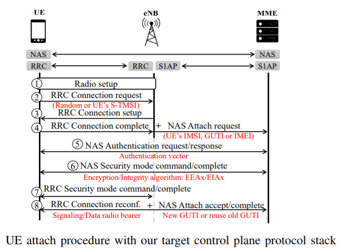

[TOC]

# Where the wild warnings are: root causes of chrome https certificate errors [^www.chrome]

[^www.chrome]: https://acmccs.github.io/papers/p1407-acerA.pdf

goal: resolve benign https errors from bad ones

#### HTTPS error warnings

alert users and protect them from nwk attack

- server side
  - date error
    - 时间过快导致证书过期
  - name mismatch
    - `*.aa.com` 不能代表`a.b.aa.com`, 所以证书里的网址无效
    - `www.aaa.com` 和 `aaa.com` 不一样
  - Authority Invalid
    - 证书链没有根证书，
    - 通常是政府网站喜欢用自己签发没有获得广泛认可的证书
  - Insufficient intermediates:
    - 通过根证书认证的证书也可以签发新证书，浏览器需要追溯到根证书
      - 缺乏部分证书链，但是有这部分证书链的缓存可以帮助追溯
      - 没有缓存 -- ERROR
  - attacker intercepts a connection causing invalid certificate chain -- malicious

  

- client side

  - incorrect client clock

    - 原因: 用户手动改时间来在游戏里作弊或者CMOS老化

  - Anti-Virus Errors

    - AV 通常会检查HTTPS，然后用自己的密钥重新签名

    

- Network

  - Captive portal
    - 联网是要重新定位到登录页，参见ZJUWlan
  - Missing TLS proxy roots
    - 代理网络的证书没有被安装

## Ideas

这篇论文没有详细介绍怎么分类，基本上是个结果展示，但是他最后提到根据不同的错误给出提示有助于用户理解问题，在检查一个协议安全性的时候，也需要从用户角度出发，确保用户能正确理解安全信息做出恰当的举动

# Neural Network-based Graph Embedding for Cross-Platform Binary Code Similarity Detection
- cross platform binary code comparison
- learn feature from CFG

Drawbacks

- minor changes in CFG maybe a fix to bug, but undetected
- graph matchings are slow

# AuthScope

> AuthScope: Towards Automatic Discovery of Vulnerable Authorizations in Online Services

- differential traffic analysis

authentication: verify user's identity

authorize: grant access of specific resources

#### Unix Authorization Security

kernel remember and track user's UID and corresponding permisssions

#### Online service authorization

difficulties:

- HTTP is stateless: send  state msg in every response & request (tokens, e.g. cookies & session id)
  - step1 authenticate over TLS
  - server create token
  - client use token to access resources

Example: (No enforcement of security token)

- security token and UID are both valid, except that they belong to different user

Obstacles:

- login to lots of apps: use facebook login
- recognize protocol fields of interest: 2 users  same message and extract differences
  - e.g. GET /api/v1//users/**21691**/notifications?_token=**e67315b35aa3** HTTP/1.1
- 上一步找到了不同的部分(加粗) 用 small Euclidean distance，通常比较小的话说明这不是随机的， 比如 `/users/21691/` 和 `/users/21682/` 
- 首先比如看到了Bob的信息，然后Alice把Euclidean distance部分替换成自己的，请求数据，如果发现返回了Bob的私人信息(通过和Bob收到的信息比对)，那么就说明有弱点
  - 注: 时间戳等在和bob比对这前需要删去
  - 注2： 比如邮箱地址/FacebookID往往是可以替换的但容易被当作欧氏距离较大，所以要分开考虑
  - 注3：有些情况，比如新闻APP总会提供同样的信息，所以要检查不登录情况下的信息，这样不登陆获得的信息用于剔除公开的，非私密下消息

#### Vulnerabilities

- no secure token
- no randomness referring to server data
- no enforcement of access control using tokens

**NOT** in this work

- token not changed
- randomness of token
- plaintext transmission of token
- no/weak authentication

#### Prerequisite

- malicious root certificate installed to perform man in the middle attack

#### Detail

##### Login

分析UI， DFS找到Facebook 登录界面，，分析UI，每一个界面由 N C T I A H

N name of activity

C class name of view (e.g. android.widget.Button)

T text or image

A action binded to view

H hierarchy of the view in the layout file

 注: 我觉得这些度量衡不是正交的，但是这样选取是因为部分参数可能缺失

找View 中 Facebook 字符串

#### 成果

4838 APP被分析，花了562.4小时 大约发送了59.2GB消息

### Review

1. 作者能做到全自动化分析，其中用了不少有趣的 workaround， 比如批量注册不同APP账号等

# LTEFuzz

> Touching the Untouchables: Dynamic Security Analysis of the LTE Control Plane

### LTE

###### UE

**UE**: User Equipment, i.e. mobile service, identified by IMEI

###### eNB

**RRU**: Remote Radio Unit, process transmission & reception of RF signals

**BBU**: process baseband signals and connected to multiple *RRUs*, each covers a cell

**eNB**: evolved node B, Base Transceiver Station, incl. *BBU*, 

**MME**: Mobility Management Entity, for control plane communication and 4G gateways,

authenticate UE, manage status of subscribers and Evolved Packet System **EPS**

**EPC**: Evolved Packet Core, key control node,

**HSS**: Home Subscriber Server, contain cryto keys for authentication

##### UE & MME Comm

4. UE 向MME 携带eNB的 NAS Attach Request
5. MME Authentication and Key Agreement, 从HSS 拿到验证向量(Authen Vector) UE和MME相互验证
6. MME选加密算法发给UE，UE生成对应密钥
7. eNB 得知加密算法
8. MME 给UE 一个临时ID

#### Extracting Security Property from standard

|      | Security property                                            | Target procedures/messages                            | Example                                     |
| ---- | ------------------------------------------------------------ | ----------------------------------------------------- | ------------------------------------------- |
| P1   | Invalid plain messages should be properly handled            | Messages that are allowed to be sent in plaintext     | RRC Connection request, IMSI Attach request |
|      |                                                              | Messages that are not allowed to be sent in plaintext | GUTI Attach request, Uplink NAS transport   |
| P2   | Invalid security protected messages should be properly handled | Messages with invalid integrity protection            | PDN disconnect request, Service request     |
|      |                                                              | Messages with invalid sequence number                 |                                             |
| P3   | Mandatory security procedures should not be bypassed         | Mutual authentication procedure                       | Authentication request                      |
|      |                                                              | Key agreement procedure                               | NAS/RRC Security mode command               |

##### P1

1. 在安全机制生效前的恶意明文 --协议问题
   - 很难区分恶意
   - 如果攻击者获取用户ID就可以伪装成用户，DoS
2. 生效后使用明文 --具体实现的漏洞
   - 基站应该拒绝
   - 示例: 如果设备重连，保存着之前的密钥和临时ID，利用临时ID可以跳过AKA，MME必须检查信息是否安全，即用户的发送的是否用之前的密钥加密过，否则攻击者可以利用之前嗅探到的临时ID切断被攻击者网络 for several seconds

##### P2

消息应该被加密，而且MAC(Message Authentication Code 必须被计算，用于验证完整性 --类似签名？)

1. 设备需要验证消息完整性 --实现漏洞
2. 序列号必须被检查防止replay atk -- 实现漏洞

##### P3

安全措施是否被绕过，比如忽略 NAS Authentication request -- 实现问题

##### Other

1. eNB过载-- 协议漏洞
   - 攻击者不断连接eBN导致其过载，因为UE不回复NAS Authentication request 会导致MME 维持连接直到回复
2. 假基站 -- 协议没考虑？

# How Unique is Your .onion? An Analysis of the Fingerprintability of Tor Onion Services

访问网页获取指纹， 抓包计算指纹进行匹配就能发现你访问了那个网站

# TODO

可能有关的论文

### CCS2017 

#### Security

- **Herding Vulnerable Cats: A Statistical Approach to Disentangle Joint Responsibility for Web Security in Shared Hosting** [^ccs171]
- **Hiding in Plain Sight: A Longitudinal Study of Combosquatting Abuse** [^ccs172]
- **Verifying Security Policies in Multi-agent Workflows with Loops** [[PDF\]](https://acmccs.github.io/papers/p633-finkbeinerA.pdf) [[Paper\]](http://arxiv.org/abs/1708.09013)
  - We consider the automatic verification of information flow security policies of web-based workflows, such as conference submission systems like EasyChair. 
-  ~~**AUTHSCOPE: Towards Automatic Discovery of Vulnerable Access Control in Online Services**~~ [[PDF\]](https://acmccs.github.io/papers/p799-zuoA.pdf) [report](#AuthScope:-Towards-Automatic-Discovery-of-Vulnerable-Authorizations-in-Online-Services)

- **Unleashing the Walking Dead: Understanding Cross-App Remote Infections on Mobile WebViews** [[PDF\]](https://acmccs.github.io/papers/p829-liA.pdf)
- **Stacco: Differentially Analyzing Side-Channel Traces for Detecting SSL/TLS Vulnerabilities in Secure Enclaves** [[PDF\]](https://acmccs.github.io/papers/p859-xiaoA.pdf)
- **Watch Me, but Don’t Touch Me! Contactless Control Flow Monitoring via Electromagnetic Emanations** [[PDF\]](https://acmccs.github.io/papers/p1095-hanA.pdf)
- **A Large-Scale Empirical Study of Security Patches** [[PDF\]](https://acmccs.github.io/papers/p2201-liA.pdf) 

#### Deep Learning

- **Machine Learning Models that Remember Too Much** [[PDF\]](https://acmccs.github.io/papers/p587-songA.pdf)https://acmccs.github.io/papers/p603-hitajA.pdf)
  -  abstract: It is important that ML models trained on sensitive inputs (e.g., personal images or documents) not leak too much information about the training data.
- **Deep Models Under the GAN: Information Leakage from Collaborative Deep Learning** [[PDF\]](https://acmccs.github.io/papers/p603-hitajA.pdf)
  - Models are typically trained in a centralized manner with all the data being processed by the same training algorithm. If the data is a collection of users' private data, including habits, personal pictures, geographical positions, interests, and more, the centralized server will have access to sensitive information that could potentially be mishandled. To tackle this problem, collaborative deep learning models have recently been proposed where parties locally train their deep learning structures and only share a subset of the parameters in the attempt to keep their respective training sets private. Parameters can also be obfuscated via differential privacy (DP) to make information extraction even more challenging, as proposed by Shokri and Shmatikov at CCS'15. 
- **Practical Secure Aggregation for Privacy-Preserving Machine Learning** [[PDF\]](https://acmccs.github.io/papers/p1175-bonawitzA.pdf)
- **A Comprehensive Symbolic Analysis of TLS 1.3** [[PDF\]](https://acmccs.github.io/papers/p1773-cremersA.pdf) [[Paper\]](http://tls13tamarin.github.io/TLS13Tamarin/) 
- **Nonmalleable Information Flow Control** [[PDF\]](https://acmccs.github.io/papers/p1875-cecchettiA.pdf) [[Paper\]](https://www.cs.cornell.edu/~ethan/papers/nmifc.pdf)
- **Cryptographically Secure Information Flow Control on Key-Value Stores** [[PDF\]](https://acmccs.github.io/papers/p1893-wayeACC.pdf)[[Paper\]](https://arxiv.org/abs/1708.08895)
- *Object Flow Integrity* [[PDF\]](https://acmccs.github.io/papers/p1909-wangA.pdf)
- 

[^ccs171]: https://acmccs.github.io/papers/p553-tajalizadehkhoobAemb.pdf
[^ccs172]: https://acmccs.github.io/papers/p569-kintisA.pdf

#### NLP

[100 Must-Read NLP Papers - GitHub](https://github.com/mhagiwara/100-nlp-papers)

#### Just Interested

- *How Unique is Your .onion? An Analysis of the Fingerprintability of Tor Onion Services* [[PDF\]](https://acmccs.github.io/papers/p2021-overdorfA.pdf) [[Paper\]](https://arxiv.org/abs/1708.08475) 

- *HexType: Efficient Detection of Type Confusion Errors for C++* [[PDF\]](https://acmccs.github.io/papers/p2373-jeonA.pdf) [[VID\]](https://www.youtube.com/watch?v=3hJjtlhKnr8)

